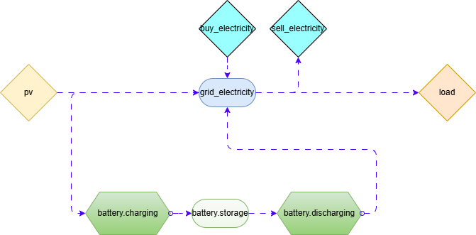

# TwinVECTOR Summer School 2025


## How to use

Make sure that you correctly `cd` into the `twinvector-summerschool-2025` directory before running any commands,
especially if you've opened the overall repository.

```bash
uv sync
```

Then check the `asset_list.csv`. This is the only file that users should modify. It contains all assets that should be
added to the model.

Running (and inspecting) the code in `run_example_summerschool.py` shows how that model could be used. This will further create an
exemplary plot and convert the model to a [https://app.diagrams.net/](https://app.diagrams.net/) (draw.io) sketch.

## System sketch 


## Folder structure
All the configuration files can be found in the `opt/` folder, which has the following structure
```
|   config_summerschool2025.iesopt.yaml
|
+---data
|   +---components
|   |       asset_list.csv
|   |       base_nodes.csv
|   |       base_profiles.csv
|   |
|   \---timeseries
|           default.csv
|
+---out
|       .gitignore
|       batt_charge_discharge.csv
|       elec_buy_sold.csv
|       plot_summerschool.html
|       pv_load.csv
|       results_SummerSchool2025.csv
|       sketch.drawio
|
\---templates
        BESS.iesopt.template.yaml
        Demand.iesopt.template.yaml
        RES.iesopt.template.yaml
```
#### Main config file
[`config_summerschool2025.iesopt.yaml`](opt/config_summerschool2025.iesopt.yaml) is the main configuration - yaml file. Let's break down its structure.

The section are the `parameters`. Here you can define default values of simulation parameters, i.e values of certain properties, such as electricity price
```yaml
parameters:
  price_electricity_buy: 1e4
  price_electricity_sell: 1e4
  # etc
```

This ist followed by the section `config`, where you define the configuration of your optimization problem. More on this, it is referred to the [IESopt documentation](https://ait-energy.github.io/iesopt/pages/manual/yaml/top_level.html). We only discuss in scope of this study the following points:

```yaml
config:
# .......

  files:
    data: default.csv
  paths:
    files: data/timeseries/
    results: out/
    components: data/components/
    templates: templates/
```
Under the points `paths/` you can define the names of the directories, where you list your:

- Input data (`data/timeseries/`)
- Your results `out/`
- Your components `data/components/`
- Your templates (`templates/`)

The next points are the `carriers`. There could be multiple ones, but now we only consider `electricity`.

Finally, we also define the components that we'd like to simulate. You can define them in two ways.

1. List them under the top-level keyword `components`
```yaml
components:
  grid_electricity:
    type: Node
    carrier: electricity

  buy_electricity:
    type: Profile
    carrier: electricity
    node_to: grid_electricity
    mode: create
    #cost: <price_electricity_buy>
    cost: 5.0 - dayahead_price@data
```
More on the specification of the components, please refer to the respective [IESopt documentation page](https://ait-energy.github.io/iesopt/pages/manual/yaml/core_components.html)

We model buying and selling electricity via a type `Profile` that handles selling /buying at a  **given price** defined under `cost:`. The value of the price is given in the column `dayahead_price` of the file `default.csv` (reffered as `data`, see above). A fixed price could be defined by using the value of `<price_electricity_buy>` (commented out).
`
2. Load them from the `components/` folder's files

```yaml
load_components:
  - asset_list.csv
```
By this, we load from the file `asset_ist.csv` the components that are listed there

#### `data` folder
In the `components/` sub-directory, you can "list" your components in the simulation that you would like to use.  You can find the files
- **asset_list.csv:** This contains our user-defined components, "BESS", "PV" and "Demand".
- base_nodes.csv and base_profiles.csv are actually not used, but if you'd wan to, you load from there `Nodes` and `Profiles`, respectively.

The `imeseries/` subdirectory contains timeseries input data. In our case, this is the file default.csv

```csv
timestamp,dayahead_price,generation_solar,generation_wind,demand
2024-01-01 00:00:00+01:00,0.1,0.0,0.2278444825614637,0.5501582663744826
2024-01-01 01:00:00+01:00,0.01,0.0,0.28101772441395084,0.5337959581202825
```

#### `out` folder
The outputs of the simulation are saved here.

- `batt_charge_discharge.csv` contains the set-points powers of the battery over the time that solved the optimization problem.
- `elec_buy_sold.csv` contains the amount of sold/bought electricity on the dayahead market, that solved the optimization problem.
- `pv_load.csv` contains the **fixed** values of PV generation and electric demand, that posed the *constraints* to the optimization problem.

It also contains the exported system drawio diagramm, and plots over the component`s powers.


#### `templates` folder 
It contains "IESopt templates". This means in our case that it contains the files defining the "custom" components `BESS`, `PV` and `Demand`.