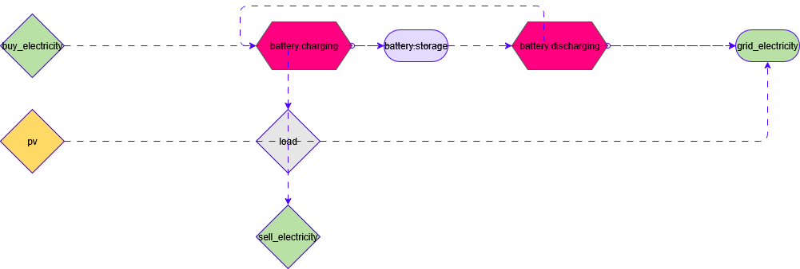

# TwinVECTOR Summer School 2025


## How to use

Make sure that you correctly `cd` into the `twinvector-summerschool-2025` directory before running any commands,
especially if you've opened the overall repository.

```bash
uv sync
```

Then check the `asset_list.csv`. This is the only file that users should modify. It contains all assets that should be
added to the model.

Running (and inspecting) the code in `run_example_summerschool.py` shows how that model could be used. This will further create an
exemplary plot and convert the model to a [https://app.diagrams.net/](https://app.diagrams.net/) (draw.io) sketch.

## System sketch 


## Folder structure
All the configuration files can be found in the `opt/` folder, which has the follwoing structure
```
|   config_summerschool2025.iesopt.yaml
|
+---data
|   +---components
|   |       asset_list.csv
|   |       base_nodes.csv
|   |       base_profiles.csv
|   |
|   \---timeseries
|           default.csv
|
+---out
|       .gitignore
|       batt_charge_discharge.csv
|       elec_buy_sold.csv
|       plot_summerschool.html
|       pv_load.csv
|       results_SummerSchool2025.csv
|       sketch.drawio
|
\---templates
        BESS.iesopt.template.yaml
        Demand.iesopt.template.yaml
        RES.iesopt.template.yaml
```